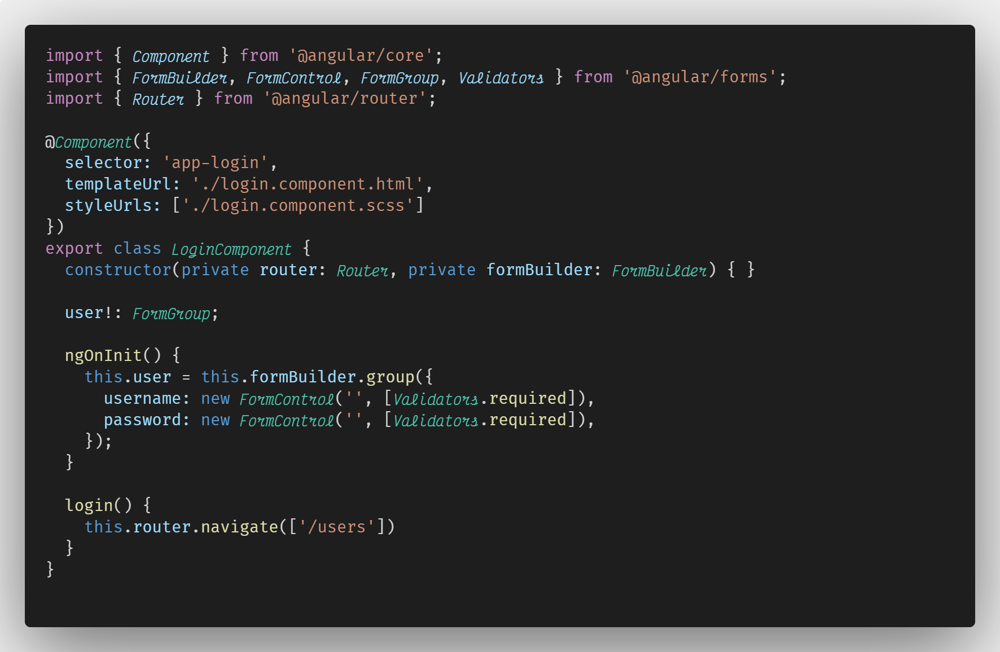
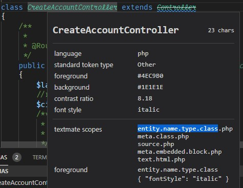

# Code fonts

This a simple mashups of the **[Victor Mono](https://github.com/rubjo/victor-mono)** and **[Fira Code](https://github.com/tonsky/FiraCode)** fonts.

We create this mix with **[FontForge](https://fontforge.org/en-US/downloads/)**.

After all we can customize settings adding something like this in *settings.json* (**Visual Code** example).

    "editor.tokenColorCustomizations": {
      "textMateRules": [
        {
          "scope": [
            //GLOBAL
            "markup.heading",
            "markup.bold",
            "strong",
          ],
          "settings": {
            "fontStyle": "bold"
          }
        },
        {
          "scope": [
            //GLOBAL
            "markup.italic",
            "entity.name.type.class",
            "entity.name.function",
            "keyword",
            "entity.other",
            //"comment",
            //PHP
            "support.class",
            "support.other.namespace",
            "support.function",
            "variable.language.this",
            //JS
            "meta.import",
            "this",
            //HTML
            "meta.function-call",
            "punctuation.section.tag",
          ],
          "settings": {
            "fontStyle": "italic"
          }
        },
      ]
    },

We can identify the elements in **Visual Code** with 

> ctrl + shift + p

And search *Inspect Editor Tokens and Scopes* 

